## 当前内存分布图


386/486 内存分页是以4K = 4096B = 0x1000B为单位的

## 物理内存管理
在内存开始的位置分配一个页用于管理内存  
每个页用一个字节来表示引用数量，最多255（一个页可能被多个进程同时使用）

## 分页
平坦模式中，线性地址，虚拟地址，逻辑地址是等价的
```c++
typedef struct page_entry_t{
    u8 present : 1; //1在内存中，0不在
    u8 write : 1; //0只读，1可读可写
    u8 user : 1; //1所有人，0超级用户，DPL<3
    u8 pwt : 1;//page write through 1直写模式，0写回模式
    u8 pcd : 1;//page cache disabled 1禁止该页缓冲
    u8 access : 1;//1被访问过，换入换出的时候用得上
    u8 dirty : 1;//页缓冲是否被写过
    u8 pat : 1;//page attribute table 页大小 0 4k，1 4M
    u8 global : 1;//1全局，所有进程都用到了，不刷新缓冲，进程切换的时候不用换这一页
    u8 ignore : 3;//闲置
    u32 index : 20;//页索引
}_packed page_entry_t
//这个结构体刚好4B，一页内存能放1024个，一页内存的页表刚好表示4M内存
```
cr3存储页目录的索引
cr0的第最高位（31位）置为1，启用分页

将最后一个页表指向页目录自己，这样就可以在启用分页之后修改页目录，该功能仅供内核使用
修改完之后需要刷新块表，即页表和页目录的缓存
`mov cr3, eax`或者`invlpg`，后者性能更高

## 位图
```c++
typedef struct bitmap_t{
    u8 *bits; //位图缓冲区
    u32 length; //缓冲区长度
    u32 offset; //位图开始的偏移
} bitmap_t;
```
